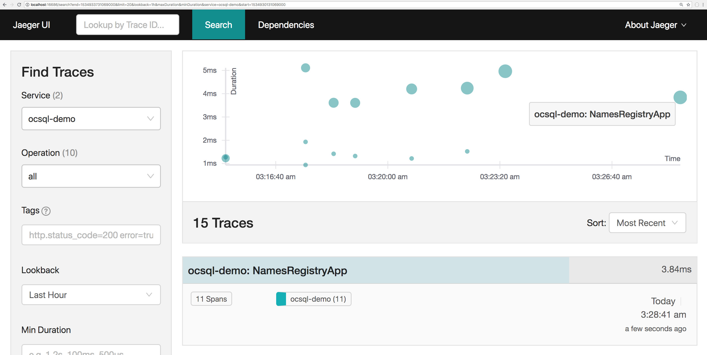

author:            Emmanuel Odeke and Prakriti Bansal
summary:           Go SQL Integration Guide
environments:      Web
id:                gosqlguide

# GoSQL Integration Guide

## Overview of the tutorial
Duration: 0:10

We have a Go "database/sql" package/wrapper that is trace instrumented with OpenCensus!

### Objectives:
By the end of this tutorial, we will be able to achieve the following:
* Use ocsql driver with sqlite3 applications
* Export traces to backend (Jaeger in this case)

### Requirements:
* Go
* Jaeger for trace exporting
* sqlite3 [Install sqlite3](https://sqlite.org/index.html)

Positive
: For assistance setting up Jaeger, [Click here](/codelabs/jaeger) for a guided codelab.

## Installing ocsql
Duration: 0:09

To install the "database/sql" plugin, please run:
```shell
go get -u -v contrib.go.opencensus.io/integrations/ocsql
```

## Getting started 
Duration: 0:08

We will first create a `go-gettable` directory and a file `main.go`, like so:
```shell
mkdir -p ocsql-e2e && cd ocsql-e2e
touch main.go
```
The following code gives a simple initialization of a database/sql instance in Go. 
```go
package main

import (
	"database/sql"
	"log"
)

func main() {
	var ordinaryDriverName string // For example "mysql", "sqlite3" etc.

	db, err := sql.Open(driverName, "resource.db")
	if err != nil {
		log.Fatalf("Failed to open the SQL database: %v", err)
	}
	defer db.Close()
}
```

## Using ocsql
Duration: 0:06

We can use the OpenCensus trace-instrumented SQL driver wrapper in one of these two ways:

### By registration
This mimicks the idiomatic recommendation to use the "database/sql" package in Go where we pass an implicitly registered driver to `sql.Open` which returns a [\*sql.DB handle](https://golang.org/pkg/database/sql/#DB)

```go
package main

import (
	"database/sql"
	"log"

	"contrib.go.opencensus.io/integrations/ocsql"
)

func main() {
	var ordinaryDriverName string // For example "mysql", "sqlite3" etc.
	// First step is to register the driver and
	// then reuse that driver name while invoking sql.Open
	driverName, err := ocsql.Register(ordinaryDriverName, ocsql.WithAllTraceOptions())
	if err != nil {
		log.Fatalf("Failed to register the ocsql driver: %v", err)
	}
	db, err := sql.Open(driverName, "resource.db")
	if err != nil {
		log.Fatalf("Failed to open the SQL database: %v", err)
	}
	defer db.Close()
}
```

### By explicitly wrapping your driver
This option is useful if you'd like to be more explicit and if your database package exports its driver implementation.

```go
package main

import "contrib.go.opencensus.io/integrations/ocsql"

func main() {
	db := ocsql.Wrap(&theDBObjectInstance{}, ocsql.WithAllTraceOptions())
	_ = db
}
```

## Enabling OpenCensus
Duration: 0:05

To enable observability with OpenCensus, we need to hook up our favorite Go exporter as per the [Go exporters guides](/guides/exporters/supported-exporters/go/).
This can be achieved like so (with Jaeger in this case):

```go
import (
	"go.opencensus.io/exporter/jaeger"
	"go.opencensus.io/trace"
)
func enableOpenCensusTracingAndExporting() error {
	// For demo purposes, we'll always trace
	trace.ApplyConfig(trace.Config{DefaultSampler: trace.AlwaysSample()})

	je, err := jaeger.NewExporter(jaeger.Options{
		AgentEndpoint: "localhost:6831",
		Endpoint:      "http://localhost:14268",
		ServiceName:   "ocsql-demo",
	})
	if err == nil {
		// On success, register it as a trace exporter
		trace.RegisterExporter(je)
	}

	return err
}
```

## End to end code
Duration: 0:04

And now to examine the exported traces, let's make a simple name registry app. For simplicitly, we use a sqlite3 database.
Place the following code in `main.go`. Save and close the file.
```go
package main

import (
	"context"
	"database/sql"
	"log"
	"time"

	"contrib.go.opencensus.io/integrations/ocsql"
	"go.opencensus.io/exporter/jaeger"
	"go.opencensus.io/trace"

	_ "github.com/mattn/go-sqlite3"
)

func main() {
	if err := enableOpenCensusTracingAndExporting(); err != nil {
		log.Fatalf("Failed to enable OpenCensus tracing and exporting: %v", err)
	}

	driverName, err := ocsql.Register("sqlite3", ocsql.WithAllTraceOptions())
	if err != nil {
		log.Fatalf("Failed to register the ocsql driver: %v", err)
	}
	db, err := sql.Open(driverName, "resource.db")
	if err != nil {
		log.Fatalf("Failed to open the SQL database: %v", err)
	}
	defer func() {
		db.Close()
		// Wait to 4 seconds so that the traces can be exported
		waitTime := 4 * time.Second
		log.Printf("Waiting for %s seconds to ensure all traces are exported before exiting", waitTime)
		<-time.After(waitTime)
	}()

	ctx, span := trace.StartSpan(context.Background(), "NamesRegistryApp")
	defer span.End()

	cCtx, cSpan := trace.StartSpan(ctx, "CreateTable")
	_, err = db.ExecContext(cCtx, `CREATE TABLE names(
            id INTEGER PRIMARY KEY AUTOINCREMENT,
            first VARCHAR(256),
            last VARCHAR(256)
        )`)
	cSpan.End()

	if err != nil {
		span.SetStatus(trace.Status{Code: trace.StatusCodeInternal, Message: err.Error()})
		log.Fatalf("Failed to create table: %v", err)
	}

	defer func() {
		// And for the cleanup
		_, err = db.ExecContext(ctx, `DROP TABLE names`)
		if err != nil {
			log.Fatalf("Failed to delete the row: %v", err)
		}
	}()

	iCtx, iSpan := trace.StartSpan(ctx, "InsertNames")
	rs, err := db.ExecContext(iCtx, `INSERT INTO names(first, last) VALUES (?, ?)`, "JANE", "SMITH")
	iSpan.End()
	if err != nil {
		log.Fatalf("Failed to insert values into tables: %v", err)
	}

	id, err := rs.LastInsertId()
	if err != nil {
		log.Fatalf("Failed to retrieve lastInserted ID: %v", err)
	}

	fCtx, fSpan := trace.StartSpan(ctx, "Find")
	row := db.QueryRowContext(fCtx, `SELECT * from names where id=?`, id)
	fSpan.End()
	type name struct {
		Id          int
		First, Last string
	}
	n1 := new(name)
	if err := row.Scan(&n1.Id, &n1.First, &n1.Last); err != nil {
		log.Fatalf("Failed to fetch row: %v", err)
	}
	log.Printf("Got back: %+v\n", n1)
}

func enableOpenCensusTracingAndExporting() error {
	// For demo purposes, we'll always trace
	trace.ApplyConfig(trace.Config{DefaultSampler: trace.AlwaysSample()})

	je, err := jaeger.NewExporter(jaeger.Options{
		AgentEndpoint: "localhost:6831",
		Endpoint:      "http://localhost:14268",
		ServiceName:   "ocsql-demo",
	})
	if err == nil {
		// On success, register it as a trace exporter
		trace.RegisterExporter(je)
	}

	return err
}
```

With the code above properly placed in `main.go`, we can now run:
```shell
go run main.go
```

## Examining the traces 
Duration: 0:03

On visiting http://localhost:16686/ we can see something similar to below:



On clicking to get details about the most recent trace:


