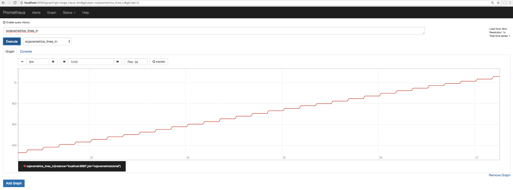
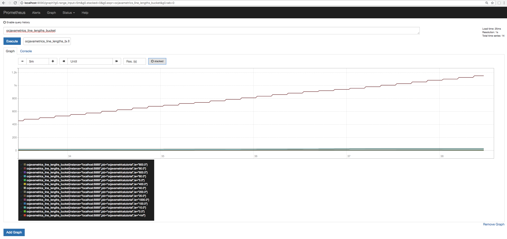

author:            Prakriti Bansal
summary:           Java Metrics Quickstart
environments:      Web
id:                javametrics

# Java Metrics Quickstart

## Overview of the tutorial
Duration: 0:10

By the end of this tutorial, we will do these four things to obtain metrics using OpenCensus:

1. Create quantitative [metrics](/stats) that we will record
2. Create [tags](/tag) that we will associate with our metrics
3. Organize our metrics, similar to writing a report, in to a `View`
4. Export our views to a backend (Prometheus in this case)

Requirements:
* Java 8+
* [Apache Maven](https://maven.apache.org/install.html)
* An installation of Prometheus which you can get from here [Install Prometheus](https://prometheus.io/docs/introduction/first_steps/)

## Installation
Duration: 0:09

We will first create our project directory, add our `pom.xml`, and our source code.

```bash
mkdir repl-app
cd repl-app

touch pom.xml

mkdir -p src/main/java/io/opencensus/metrics/quickstart
touch src/main/java/io/opencensus/metrics/quickstart/Repl.java
```

Put this in your newly generated `pom.xml` file:

```xml
<project xmlns="http://maven.apache.org/POM/4.0.0" xmlns:xsi="http://www.w3.org/2001/XMLSchema-instance"
    xsi:schemaLocation="http://maven.apache.org/POM/4.0.0 http://maven.apache.org/maven-v4_0_0.xsd">
        <modelVersion>4.0.0</modelVersion>
        <groupId>io.opencensus.metrics.quickstart</groupId>
        <artifactId>quickstart</artifactId>
        <packaging>jar</packaging>
        <version>1.0-SNAPSHOT</version>
        <name>quickstart</name>
        <url>http://maven.apache.org</url>

    <properties>
        <project.build.sourceEncoding>UTF-8</project.build.sourceEncoding>
        <opencensus.version>0.15.0</opencensus.version> <!-- The OpenCensus version to use -->
    </properties>

    <build>
        <extensions>
            <extension>
                <groupId>kr.motd.maven</groupId>
                <artifactId>os-maven-plugin</artifactId>
                <version>1.5.0.Final</version>
                </extension>
            </extensions>

        <pluginManagement>
            <plugins>
                <plugin>
                    <groupId>org.apache.maven.plugins</groupId>
                    <artifactId>maven-compiler-plugin</artifactId>
                    <version>3.7.0</version>
                    <configuration>
                        <source>1.8</source>
                        <target>1.8</target>
                    </configuration>
                </plugin>

                <plugin>
                    <groupId>org.codehaus.mojo</groupId>
                    <artifactId>appassembler-maven-plugin</artifactId>
                    <version>1.10</version>
                    <configuration>
                        <programs>
                            <program>
                                <id>Repl</id>
                                <mainClass>io.opencensus.metrics.quickstart.Repl</mainClass>
                            </program>
                        </programs>
                    </configuration>
                </plugin>
            </plugins>

        </pluginManagement>

    </build>
</project>
```

Put this in `src/main/java/io/opencensus/metrics/quickstart/Repl.java`:

```java
package io.opencensus.metrics.quickstart;

import java.io.BufferedReader;
import java.io.IOException;
import java.io.InputStreamReader;

public class Repl {
    public static void main(String ...args) {
        BufferedReader stdin = new BufferedReader(new InputStreamReader(System.in));

        while (true) {
            try {
                readEvaluateProcessLine(stdin);
            } catch (IOException e) {
                System.err.println("Exception "+ e);
            }
        }
    }

    private static String processLine(String line) {
        return line.toUpperCase();
    }

    private static void readEvaluateProcessLine(BufferedReader in) throws IOException {
        System.out.print("> ");
        System.out.flush();
        String line = in.readLine();
        String processed = processLine(line);
        System.out.println("< " + processed + "\n");
    }
}
```

To install required dependencies, run this from your project's root directory:

```bash
# Make sure to be in your project's root directory
mvn install
```

## Getting Started
Duration: 0:07

The Repl application takes input from users, converts any lower-case letters into upper-case letters, and echoes the result back to the user, for example:
```bash
> foo
< FOO
```

We will instrument this application to collect metrics, such as:

- Latency per processing loop
- Number of lines read
- Number of errors
- Line lengths

Let's first run the application and see what we have.
```bash
mvn exec:java -Dexec.mainClass=io.opencensus.metrics.quickstart.Repl
```
You will be given a text prompt. Try typing in a lowercase word and hit `enter` to receive the uppercase equivalent.

You should see something like this after a few tries:


To exit out of the application, hit `ctrl + c` on your keyboard.

From here on out, we will be rewriting sections of `src/main/java/io/opencensus/metrics/quickstart/Repl.java` and `pom.xml`.

You can recompile and run the application after editing it by running this command:

```bash
mvn install
```
## Enable Metrics
Duration: 0:06

<a name="import-metrics-packages"></a>
### Import Packages
To enable metrics, we’ll declare the dependencies in your `pom.xml` file. Add the following snippet of code after the `<properties>...</properties>` node.

```xml
<dependencies>
    <dependency>
        <groupId>io.opencensus</groupId>
        <artifactId>opencensus-api</artifactId>
        <version>${opencensus.version}</version>
    </dependency>

    <dependency>
        <groupId>io.opencensus</groupId>
        <artifactId>opencensus-impl</artifactId>
        <version>${opencensus.version}</version>
    </dependency>
</dependencies>
```

We will now be importing modules into `src/main/java/io/opencensus/metrics/quickstart/Repl.java`. Append the following snippet after the existing `import` statements:

```java
import io.opencensus.common.Scope;
import io.opencensus.stats.Stats;
import io.opencensus.stats.Measure;
import io.opencensus.stats.Measure.MeasureLong;
import io.opencensus.stats.Measure.MeasureDouble;
import io.opencensus.stats.Stats;
import io.opencensus.stats.StatsRecorder;
import io.opencensus.stats.View;
import io.opencensus.tags.Tags;
import io.opencensus.tags.Tagger;
import io.opencensus.tags.TagContext;
import io.opencensus.tags.TagContextBuilder;
import io.opencensus.tags.TagKey;
import io.opencensus.tags.TagValue;
```

### Create Measures for Metrics
First, we will create the variables needed to later record our metrics. Place the following snippet on the line after `public class Repl {`:

```java
// The latency in milliseconds
private static final MeasureDouble M_LATENCY_MS = MeasureDouble.create("repl/latency", "The latency in milliseconds per REPL loop", "ms");

// Counts/groups the lengths of lines read in.
private static final MeasureLong M_LINE_LENGTHS = MeasureLong.create("repl/line_lengths", "The distribution of line lengths", "By");

private static final Tagger tagger = Tags.getTagger();
private static final StatsRecorder statsRecorder = Stats.getStatsRecorder();

private static void recordStat(MeasureLong ml, Long n) {
    statsRecorder.newMeasureMap().put(ml, n);
}
```

### Create Tags
Now we will create the variable later needed to record extra text meta-data.

Insert the following snippet on the line before `private static final Tagger tagger = Tags.getTagger();`:

```java
// The tag "method"
private static final TagKey KEY_METHOD = TagKey.create("method");
private static final TagKey KEY_STATUS = TagKey.create("status");
private static final TagKey KEY_ERROR = TagKey.create("error");
```

We will later use this tag, called `KEY_METHOD`, to record what method is being invoked. In our scenario, we will only use it to record that "repl" is calling our data.

We will now create helper functions to assist us with recording Tagged Stats. One will record a `Long`, another a `Double`, and finally an array of `Doubles`.

Insert the following snippet after `private static void recordStat`:

```java
private static void recordTaggedStat(TagKey key, String value, MeasureLong ml, Long n) {
    TagContext tctx = tagger.emptyBuilder().put(key, TagValue.create(value)).build();
    try (Scope ss = tagger.withTagContext(tctx)) {
        statsRecorder.newMeasureMap().put(ml, n).record();
    }
}

private static void recordTaggedStat(TagKey key, String value, MeasureDouble md, Double d) {
    TagContext tctx = tagger.emptyBuilder().put(key, TagValue.create(value)).build();
    try (Scope ss = tagger.withTagContext(tctx)) {
        statsRecorder.newMeasureMap().put(md, d).record();
    }
}

private static void recordTaggedStat(TagKey[] keys, String[] values, MeasureDouble md, Double d) {
    TagContextBuilder builder = tagger.emptyBuilder();
    for (int i = 0; i < keys.length; i++) {
        builder.put(keys[i], TagValue.create(values[i]));
    }
    TagContext tctx = builder.build();

    try (Scope ss = tagger.withTagContext(tctx)) {
        statsRecorder.newMeasureMap().put(md, d).record();
    }
}
```

### Recording Metrics
Finally, we'll hook our stat recorders in to `main`, `processLine`, and `readEvaluateProcessLine`:

```java
while (true) {
    long startTimeNs = System.nanoTime();

    try {
        readEvaluateProcessLine(stdin);
        TagKey[] tagKeys = {KEY_METHOD, KEY_STATUS};
        String[] tagValues = {"repl", "OK"};
        recordTaggedStat(tagKeys, tagValues, M_LATENCY_MS,
        sinceInMilliseconds(startTimeNs));
    } catch (IOException e) {
        System.err.println("EOF bye "+ e);
        return;
    } catch (Exception e) {
        TagKey[] tagKeys = {KEY_METHOD, KEY_STATUS, KEY_ERROR};
        String[] tagValues = {"repl", "ERROR", e.getMessage()};
        recordTaggedStat(tagKeys, tagValues, M_LATENCY_MS,
        sinceInMilliseconds(startTimeNs));
        return;
    }
}

private static String processLine(String line) {
    long startTimeNs = System.nanoTime();

    try {
        return line.toUpperCase();
    } finally {
        TagKey[] tagKeys = {KEY_METHOD, KEY_STATUS};
        String[] tagValues = {"repl", "OK"};
        recordTaggedStat(tagKeys, tagValues, M_LATENCY_MS, sinceInMilliseconds(startTimeNs));
    }
}

private static double sinceInMilliseconds(long startTimeNs) {
    return (new Double(System.nanoTime() - startTimeNs))/1e6;
}

private static void readEvaluateProcessLine(BufferedReader in) throws IOException {
    System.out.print("> ");
    System.out.flush();

    String line = in.readLine();
    String processed = processLine(line);
    System.out.println("< " + processed + "\n");
    if (line != null && line.length() > 0) {
        recordStat(M_LINE_LENGTHS, new Long(line.length()));
    }
}
```

## Enable Views
Duration: 0:05

In order to analyze these stats, we’ll need to aggregate our data with Views.

### Import Packages

```java
import java.util.ArrayList;
import java.util.Arrays;
import java.util.Collections;
import java.util.List;

import io.opencensus.stats.Aggregation;
import io.opencensus.stats.Aggregation.Distribution;
import io.opencensus.stats.BucketBoundaries;
import io.opencensus.stats.View.Name;
import io.opencensus.stats.ViewManager;
import io.opencensus.stats.View.AggregationWindow.Cumulative;
```

### Create Views
Append this code snippet as our last function inside of `public class Repl`:

``` java
private static void registerAllViews() {
    // Defining the distribution aggregations
    Aggregation latencyDistribution = Distribution.create(BucketBoundaries.create(
        Arrays.asList(
            // [>=0ms, >=25ms, >=50ms, >=75ms, >=100ms, >=200ms, >=400ms, >=600ms, >=800ms, >=1s,>=2s, >=4s, >=6s]
            0.0, 25.0, 50.0, 75.0, 100.0, 200.0, 400.0, 600.0, 800.0, 1000.0, 2000.0, 4000.0, 6000.0)
        ));

    Aggregation lengthsDistribution =
        Distribution.create(BucketBoundaries.create(
            Arrays.asList(
                // [>=0B, >=5B, >=10B, >=20B, >=40B, >=60B, >=80B, >=100B, >=200B, >=400B, >=600B, >=800B, >=1000B]
                0.0, 5.0, 10.0, 20.0, 40.0, 60.0, 80.0, 100.0, 200.0, 400.0, 600.0, 800.0, 1000.0)
            ));

    // Define the count aggregation
    Aggregation countAggregation = Aggregation.Count.create();

    // So tagKeys
    List<TagKey> noKeys = new ArrayList<TagKey>();

    // Define the views
    View[] views = new View[]{
        View.create(Name.create("ocjavametrics/latency"), "The distribution of latencies", M_LATENCY_MS, latencyDistribution, Collections.unmodifiableList(Arrays.asList(KEY_METHOD, KEY_STATUS, KEY_ERROR))),
        View.create(Name.create("ocjavametrics/lines_in"), "The number of lines read in from standard input", M_LINE_LENGTHS, countAggregation, noKeys),
        View.create(Name.create("ocjavametrics/line_lengths"), "The distribution of line lengths", M_LINE_LENGTHS, lengthsDistribution, noKeys)
    };

    // Create the view manager
    ViewManager vmgr = Stats.getViewManager();

    // Then finally register the views
    for (View view : views) {
        vmgr.registerView(view);
    }
}
```


### Register Views
We will create a function called `setupOpenCensusAndPrometheusExporter` and call it from our main function:

```java
public static void main(String ...args) {
    // Step 1. Enable OpenCensus Metrics.
    try {
        setupOpenCensusAndPrometheusExporter();
    } catch (IOException e) {
        System.err.println("Failed to create and register OpenCensus Prometheus Stats exporter "+ e);
        return;
    }

    BufferedReader stdin = new BufferedReader(new InputStreamReader(System.in));

    while (true) {
        long startTimeNs = System.nanoTime();

        try {
            readEvaluateProcessLine(stdin);
            TagKey[] tagKeys = {KEY_METHOD, KEY_STATUS};
            String[] tagValues = {"repl", "OK"};
            recordTaggedStat(tagKeys, tagValues, M_LATENCY_MS,
                sinceInMilliseconds(startTimeNs));
        } catch (IOException e) {
            System.err.println("EOF bye "+ e);
            return;
        } catch (Exception e) {
            TagKey[] tagKeys = {KEY_METHOD, KEY_STATUS, KEY_ERROR};
            String[] tagValues = {"repl", "ERROR", e.getMessage()};
            recordTaggedStat(tagKeys, tagValues, M_LATENCY_MS,
                sinceInMilliseconds(startTimeNs));
            return;
        }
    }
}

private static void setupOpenCensusAndPrometheusExporter() throws IOException {
    // Firstly register the views
    registerAllViews();
}
```


## Exporting stats
Duration: 0:04

### Import Packages
Add the following code snippet to your `<dependencies>...</dependencies>` node in `pom.xml`:
```xml
<dependency>
    <groupId>io.opencensus</groupId>
    <artifactId>opencensus-exporter-stats-prometheus</artifactId>
    <version>${opencensus.version}</version>
</dependency>

<dependency>
    <groupId>io.prometheus</groupId>
    <artifactId>simpleclient_httpserver</artifactId>
    <version>0.4.0</version>
</dependency>
```

We also need to expose the Prometheus endpoint say on address "localhost:8889" in order for Prometheus to scrape our application.
Please add the following to our Java code

Add the following code snippet to `src/main/java/io/opencensus/metrics/quickstart/Repl.java`:

``` java
import io.opencensus.exporter.stats.prometheus.PrometheusStatsCollector;
import io.prometheus.client.exporter.HTTPServer;
```

### Export Views
We will further expand upon `setupOpenCensusAndPrometheusExporter`:

```java
private static void setupOpenCensusAndPrometheusExporter() throws IOException {
    // Firstly register the views
    registerAllViews();

    // Create and register the Prometheus exporter
    PrometheusStatsCollector.createAndRegister();

    // Run the server as a daemon on address "localhost:8889"
    HTTPServer server = new HTTPServer("localhost", 8889, true);
}
```

### Running the tutorial

This step involves running the tutorial application in one terminal and then Prometheus itself in another terminal.

Having properly installed Java and Maven, in one terminal, please run

```shell
mvn install
mvn exec:java -Dexec.mainClass=io.opencensus.metrics.quickstart.Repl
```

### Prometheus configuration file

To allow Prometheus to scrape from our application, we have to point it towards the tutorial application whose
server is running on "localhost:8889".

To do this, we firstly need to create a YAML file with the configuration e.g. `promconfig.yaml`
whose contents are:
```yaml
scrape_configs:
    - job_name: 'ocjavametricstutorial'

    scrape_interval: 10s

    static_configs:
    - targets: ['localhost:8889']
```

### Running Prometheus

With that file saved as `promconfig.yaml` we should now be able to run Prometheus like this

```shell
prometheus --config.file=promconfig.yaml
```

and then return to the terminal that's running the Java metrics quickstart and generate some work by typing inside it.


## Viewing your metrics
Duration: 0:00

With the above you should now be able to navigate to the Prometheus UI at http://localhost:9090

which should show:

* Available metrics


* Lines-in counts


* Latency distributions


* Line lengths distributions

