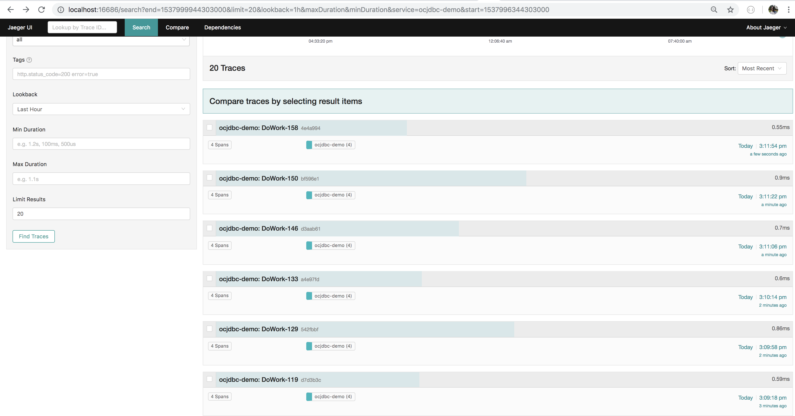
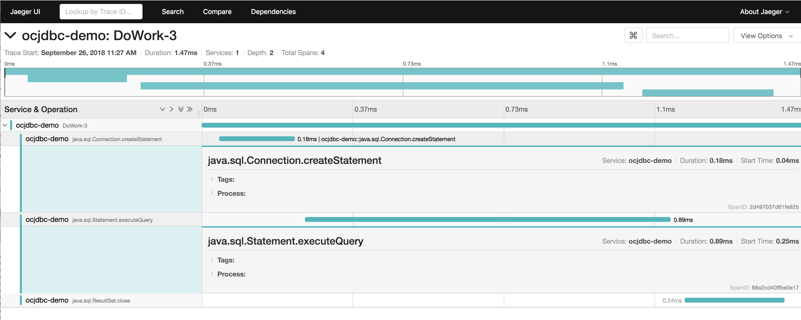
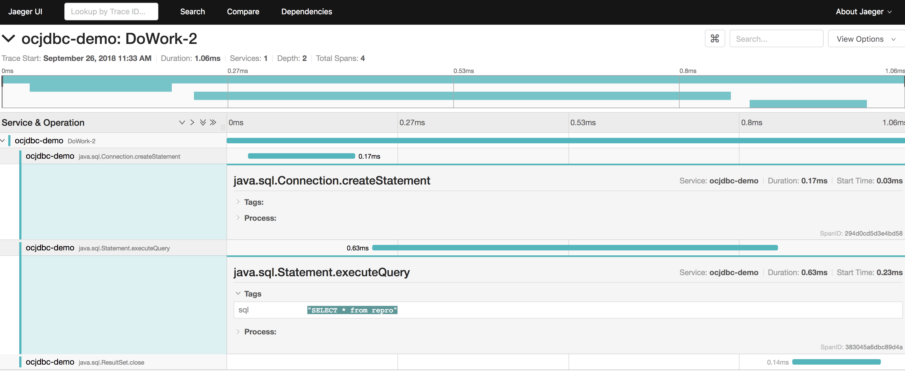
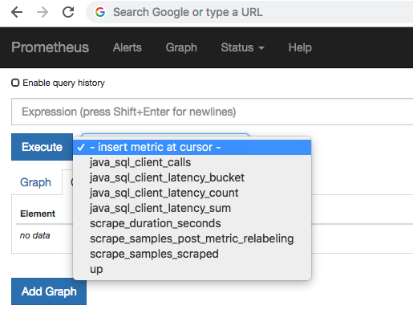
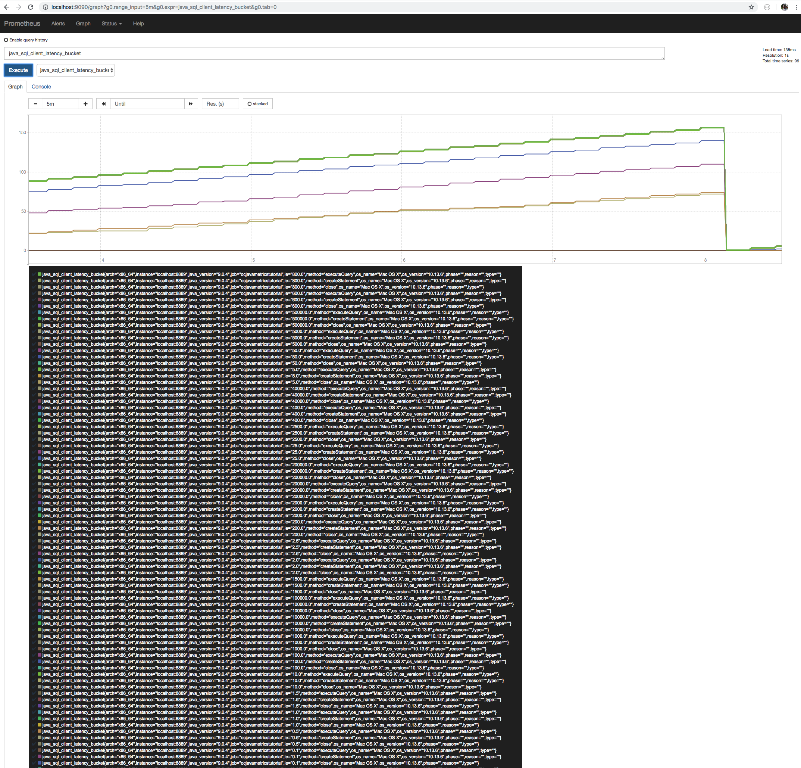
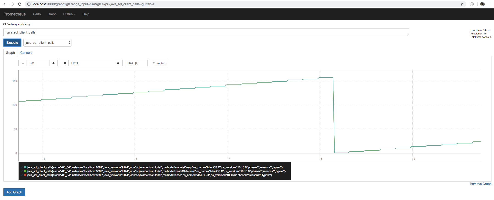

author:            Emmanuel Odeke and Prakriti Bansal
summary:           Java SQL Integration Guide
environments:      Web
id:                javasqlguide

# Java SQL Integration Guide

## Overview of the tutorial
Duration: 0:10

### Introduction

The Java Database Connectivity(JDBC) API provides universal data access from the Java programming language as
documented at https://docs.oracle.com/javase/8/docs/technotes/guides/jdbc/

Using OpenCensus, we've combined the best of both worlds: observability with distributed tracing and metrics
to empower Java developers that use any sort of a database/data source with a [JDBC](https://docs.oracle.com/javase/8/docs/technotes/guides/jdbc/) driver.

[ocjdbc](https://github.com/opencensus-integrations/ocjdbc) is a type-4 JDBC wrapper for the Java language. We've instrumented it with OpenCensus to provide
observability with tracing and metrics. It works by wrapping your already obtained JDBC Connection using
the class `ocjdbc.OcWrapConnection`. It wraps any JDBC driver. It is hosted on our integrations page on
Github at https://github.com/opencensus-integrations/ocjdbc
but also distributed as a Maven, Gradle, Ivy and Builder artifacts.

### Objectives:
By the end of this tutorial, we will be able to achieve the following:
* Use ocjdbc driver with MySQL applications
* Export metrics to backend (Prometheus in this case)
* Export traces to backend (Jaeger in this case)

### Requirements:
* Java 8+
* [Apache Maven](https://maven.apache.org/install.html)
* Prometheus for stats exporting [Install Prometheus](https://prometheus.io/docs/introduction/first_steps/)
* Jaeger for trace exporting
* MySQL server [Install MySQL](https://dev.mysql.com/doc/mysql-getting-started/en/)

Positive
: For assistance setting up Prometheus, [Click here](/codelabs/prometheus) for a guided codelab.

Positive
: For assistance setting up Jaeger, [Click here](/codelabs/jaeger) for a guided codelab.

## Installing ocjdbc
Duration: 0:09

The ocjdbc can be installed in one of the following ways. 

### Maven
```xml
<dependency>
<groupId>io.orijtech.integrations</groupId>
<artifactId>ocjdbc</artifactId>
<version>0.0.2</version>
</dependency>
```

### Gradle
```gradle
// https://mvnrepository.com/artifact/io.orijtech.integrations/ocjdbc
compile group: 'io.orijtech.integrations', name: 'ocjdbc', version: '0.0.2'
```

### Ivy
```xml
<!-- https://mvnrepository.com/artifact/io.orijtech.integrations/ocjdbc -->
<dependency org="io.orijtech.integrations" name="ocjdbc" rev="0.0.2"/>
```

### Buildr
```python
# https://mvnrepository.com/artifact/io.orijtech.integrations/ocjdbc
'io.orijtech.integrations:ocjdbc:jar:0.0.2'
```

## Getting started 
Duration: 0:08

We will first create our project directory: 
```shell
mkdir sql-app
cd sql-app

touch pom.xml

mkdir -p src/main/java/io/opencensus/tutorial/ocjdbc
touch src/main/java/io/opencensus/tutorial/ocjdbc/App.java
```
Add the following code to pom.xml to install the required dependencies. Save and close the file.

```xml
<project xmlns="http://maven.apache.org/POM/4.0.0" xmlns:xsi="http://www.w3.org/2001/XMLSchema-instance" xsi:schemaLocation="http://maven.apache.org/POM/4.0.0 http://maven.apache.org/maven-v4_0_0.xsd">
    <modelVersion>4.0.0</modelVersion>
    <groupId>io.opencensus</groupId>
    <artifactId>ocjdbc-app</artifactId>
    <packaging>jar</packaging>
    <version>0.0.1</version>
    <name>ocjdbc-app</name>
    <url>http://maven.apache.org</url>

    <properties>
        <project.build.sourceEncoding>UTF-8</project.build.sourceEncoding>
        <opencensus.version>0.16.1</opencensus.version>
    </properties>

    <dependencies>
        <dependency>
            <groupId>io.opencensus</groupId>
            <artifactId>opencensus-api</artifactId>
            <version>${opencensus.version}</version>
        </dependency>

        <dependency>
            <groupId>io.opencensus</groupId>
            <artifactId>opencensus-impl</artifactId>
            <version>${opencensus.version}</version>
        </dependency>

        <dependency>
            <groupId>io.orijtech.integrations</groupId>
            <artifactId>ocjdbc</artifactId>
            <version>0.0.2</version>
        </dependency>

        <dependency>
            <groupId>mysql</groupId>
            <artifactId>mysql-connector-java</artifactId>
            <version>8.0.12</version>
        </dependency>

        <dependency>
            <groupId>io.opencensus</groupId>
            <artifactId>opencensus-exporter-stats-prometheus</artifactId>
            <version>${opencensus.version}</version>
        </dependency>

        <dependency>
            <groupId>io.prometheus</groupId>
            <artifactId>simpleclient_httpserver</artifactId>
            <version>0.4.0</version>
        </dependency>

        <dependency>
            <groupId>io.opencensus</groupId>
            <artifactId>opencensus-exporter-trace-jaeger</artifactId>
            <version>${opencensus.version}</version>
        </dependency>
    </dependencies>

    <build>
        <extensions>
            <extension>
                <groupId>kr.motd.maven</groupId>
                <artifactId>os-maven-plugin</artifactId>
                <version>1.5.0.Final</version>
            </extension>
        </extensions>

        <pluginManagement>
            <plugins>
                <plugin>
                    <groupId>org.apache.maven.plugins</groupId>
                    <artifactId>maven-compiler-plugin</artifactId>
                    <version>3.7.0</version>
                    <configuration>
                        <source>1.8</source>
                        <target>1.8</target>
                    </configuration>
                </plugin>
            </plugins>
        </pluginManagement>

        <plugins>
            <plugin>
                <groupId>org.codehaus.mojo</groupId>
                <artifactId>appassembler-maven-plugin</artifactId>
                <version>1.10</version>
                <configuration>
                    <programs>
                        <program>
                            <id>SQLApp</id>
                            <mainClass>io.opencensus.tutorials.ocjdbc.App</mainClass>
                        </program>
                    </programs>
                </configuration>
            </plugin>
        </plugins>
    </build>
</project>
```

Now modify the Prometheus config.yaml saved in `config.yaml` as follows:
```yaml
scrape_configs:
  - job_name: 'ocjavametricstutorial'

    scrape_interval: 10s

    static_configs:
      - targets: ['localhost:8889']
```

## Using ocjdbc
Duration: 0:06

Using ocjdbc simply requires you to just wrap your already created JDBC connection and it wraps every method
to provide observability by metrics and tracing. 
In this example, we'll just wrap a MySQL Connector/J app as below. 
```java
package io.opencensus.tutorial.ocjdbc;

import io.orijtech.integrations.ocjdbc.Observability;
import io.orijtech.integrations.ocjdbc.OcWrapConnection;
import java.util.EnumSet;

public class App {
  private static final Tracer tracer = Tracing.getTracer();

  public static void main(String... args) {
    java.sql.Connection conn = null;

    try {
      enableObservability();

      // Load and use the MySQL Connector/J driver.
      Class.forName("com.mysql.cj.jdbc.Driver").newInstance();

      java.sql.Connection originalConn =
          java.sql.DriverManager.getConnection(
              "jdbc:mysql://localhost/repro?user=root&useSSL=false&serverTimezone=UTC");

      // Then create/wrap it with the instrumented Connection from
      // "io.orijtech.integrations.ocjdbc".
      conn = new OcWrapConnection(originalConn, EnumSet.of(Observability.TraceOption.NONE));
      doWork(conn);
    } catch (Exception e) {
      e.printStackTrace();
      System.err.println(String.format("Failed to create SQLDriver: %s", e));
      return;
    } finally {
      // Finally close the connection when done.
      if (conn != null) {
        try {
          conn.close();
        } catch (Exception e) {
          e.printStackTrace();
          System.err.println(String.format("Failed to close conn: %s", e));
        }
      }
    }
  }

  public static void doWork(java.sql.Connection conn) throws Exception {
    System.out.println("Hello OCJDBC!");

    for (int i = 0; i < 200; i++) {
      Scope ss = tracer.spanBuilder(String.format("DoWork-%d", i)).startScopedSpan();
      try {
        java.sql.Statement stmt = conn.createStatement();
        java.sql.ResultSet rs = stmt.executeQuery("SELECT * from repro");
        rs.close();
        System.out.println("Iteration #" + i);
      } finally {
        ss.close();
      }

      Thread.sleep(4000);
    }
  }
}
```
Place the above code in `App.java` and save the file.

### Annotating traces with the various SQL statements
We also provide an option for your spans to be annotated with the SQL that accompanies an `exec*`.

However, please note that this is optional and could be a security concern due to Personally Identifiable Information(PII)
being used in the SQL query.

This option is available via `TraceOption` of `Observability.ANNOTATE_TRACES_WITH_SQL` which is passed into the constructors for: 
* OcWrapConnection
* OcWrapCallableStatement
* OcWrapPreparedStatement
* OcWrapStatement

thus when used to create the wrapped `java.sql.Connection`:
```java
java.sql.Connection conn = new OcWrapConnection(originalConn,
                                // And passing this option to allow the spans
                                // to be annotated with the SQL queries.
                                // Please note that this could be a security concern
                                // since it could reveal personally identifying information.
                                EnumSet.of(Observability.TraceOption.ANNOTATE_TRACES_WITH_SQL));
```

## Enabling OpenCensus
Duration: 0:05

To enable observability with OpenCensus, you need to have enabled trace and metrics exporters. 
For this, add the following import statements to `App.java`
```java
import io.opencensus.exporter.trace.jaeger.JaegerTraceExporter;
import io.opencensus.exporter.stats.prometheus.PrometheusStatsCollector;
import io.prometheus.client.exporter.HTTPServer;
import io.opencensus.trace.samplers.Samplers;
import io.opencensus.common.Scope;
import io.opencensus.trace.Tracer;
import io.opencensus.trace.Tracing;
import io.opencensus.trace.config.TraceConfig;
```
Now, place the following method inside `App.java` to enable observability. 
```java
public static void enableObservability() throws Exception {
    // Enable metrics with OpenCensus.
    Observability.registerAllViews();
    
    TraceConfig traceConfig = Tracing.getTraceConfig();
    // For demo purposes, lets always sample.
    traceConfig.updateActiveTraceParams(
             traceConfig.getActiveTraceParams().toBuilder().setSampler(Samplers.alwaysSample()).build());

    // The trace exporter.
    JaegerTraceExporter.createAndRegister("http://127.0.0.1:14268/api/traces", "ocjdbc-demo");

    // The metrics exporter.
    PrometheusStatsCollector.createAndRegister();

    // Run the server as a daeon on address "localhost:8889".
	HTTPServer server = new HTTPServer("localhost", 8889);
}
```

## Running it
Duration: 0:04

With the Java source code properly placed in `src/main/java/io/opencensus/tutorial/ocjdbc/App.java` and the `pom.xml` file, we can now do
```shell
mvn install && mvn exec:java -Dexec.mainClass=io.opencensus.tutorial.ocjdbc.App
```

In another terminal, please run Prometheus like so:
```shell
prometheus --config.file=config.yaml
```

This should then produce such output:
```shell
Hello OCJDBC!
Iteration #0
Iteration #1
Iteration #2
Iteration #3
Iteration #4
Iteration #5
Iteration #6
Iteration #7
Iteration #8
Iteration #9
Iteration #10
Iteration #11
Iteration #12
Iteration #13
Iteration #14
Iteration #15
Iteration #16
```

## Examining the traces 
Duration: 0:03

With Jaeger running, we can navigate to the Jaeger UI at http://localhost:16686/search.
You should be able to see such visuals.

* All traces


* An individual trace with option `Observability.ANNOTATE_TRACES_WITH_SQL` disabled


* An individual trace with option  `Observability.ANNOTATE_TRACES_WITH_SQL` enabled


## Examining the metrics
Duration: 0:02

With Prometheus running, we can navigate to the Prometheus UI at http://localhost:9090/graph.
You should be able to see such visuals.

* All metrics


* Latency buckets


* Calls

